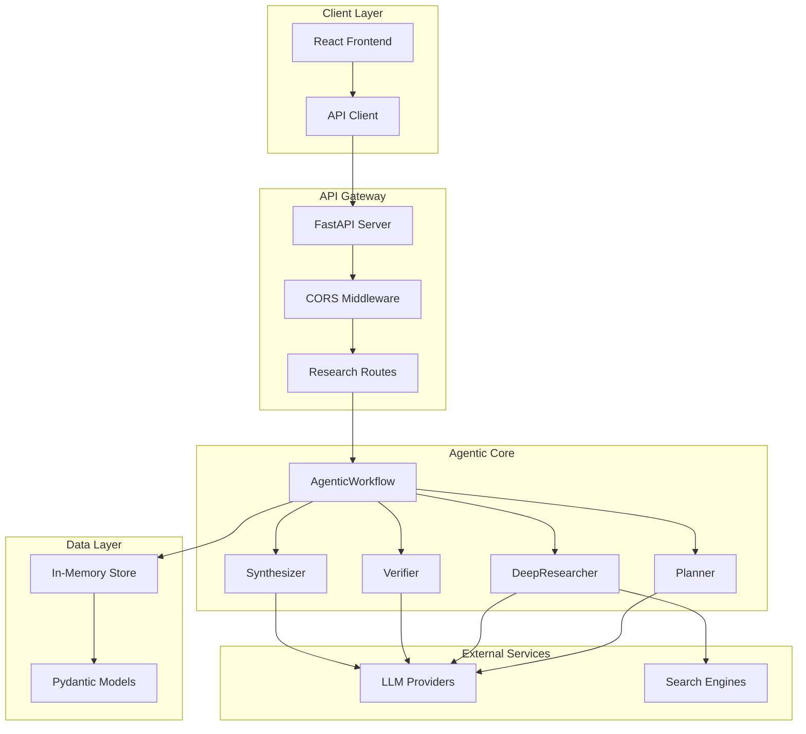
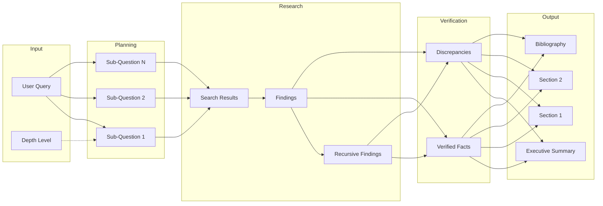
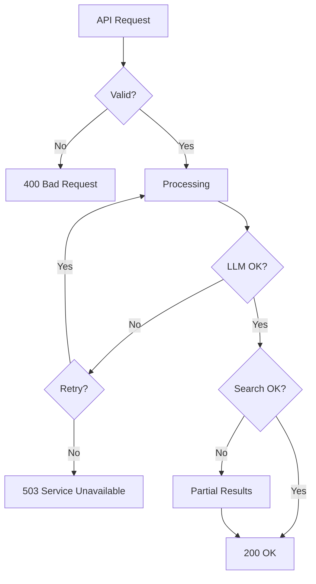

# Intelligent Research Agent - Architecture

## System Overview

---

## Agentic Workflow Pipeline

```mermaid
sequenceDiagram
    participant User
    participant API
    participant Orchestrator
    participant Planner
    participant Researcher
    participant Verifier
    participant Synthesizer
    participant LLM
    participant Search
    
    User->>API: POST /research/execute
    API->>Orchestrator: StartWorkflow(query)
    
    rect rgb(51, 65, 85)
        Note over Orchestrator,Planner: Phase 1: PLANNING
        Orchestrator->>Planner: create_plan(query)
        Planner->>LLM: Generate sub-questions
        LLM-->>Planner: 3-10 questions
        Planner-->>Orchestrator: ResearchPlan
    end
    
    rect rgb(30, 58, 95)
        Note over Orchestrator,Search: Phase 2: EXECUTING
        Orchestrator->>Researcher: execute_research(plan)
        loop For each sub-question
            Researcher->>Search: search_all_providers()
            Search-->>Researcher: SearchResults
            Researcher->>LLM: extract_facts()
            LLM-->>Researcher: Facts + new topics
        end
        Researcher-->>Orchestrator: ResearchFindings[]
    end
    
    rect rgb(59, 130, 246)
        Note over Orchestrator,LLM: Phase 3: VERIFYING
        Orchestrator->>Verifier: verify_findings()
        Verifier->>LLM: Cross-reference & detect conflicts
        LLM-->>Verifier: VerifiedFacts + Discrepancies
        Verifier-->>Orchestrator: (facts, discrepancies)
    end
    
    rect rgb(16, 185, 129)
        Note over Orchestrator,LLM: Phase 4: SYNTHESIZING
        Orchestrator->>Synthesizer: generate_report()
        Synthesizer->>LLM: Create narrative sections
        LLM-->>Synthesizer: 300+ word sections
        Synthesizer-->>Orchestrator: NarrativeReport
    end
    
    Orchestrator-->>API: Complete
    API-->>User: Report ready
```

---

## Data Flow Diagram

---

## Component Architecture

### Backend Modules

| Module | Responsibility | Dependencies |
|--------|----------------|--------------|
| `planner.py` | Query → Sub-questions | LLM Client |
| `deep_researcher.py` | Sub-questions → Findings | LLM + Search |
| `verifier.py` | Findings → Verified Facts | LLM Client |
| `synthesizer.py` | Facts → Narrative Report | LLM Client |
| `agentic_workflow.py` | Orchestration | All modules |

### Frontend Components

| Component | Responsibility |
|-----------|----------------|
| `SearchInput` | Query input + depth selection |
| `ProgressIndicator` | Real-time workflow status |
| `ExecutiveBrief` | Summary display |
| `ReportTabs` | Tabbed sections |
| `CitationTooltip` | Inline source details |
| `Bibliography` | Full source list |
| `DiscrepancyPanel` | Conflicting claims |

---

## API Endpoints

| Method | Endpoint | Description | Status Codes |
|--------|----------|-------------|--------------|
| POST | `/api/research/plan` | Preview plan | 200, 400, 500 |
| POST | `/api/research/execute` | Start research | 200, 400, 500 |
| GET | `/api/research/{id}/status` | Poll progress | 200, 404 |
| GET | `/api/research/{id}/report` | Get report | 200, 400, 404 |
| GET | `/api/research/{id}/citations` | Get sources | 200, 404 |

---

## Error Handling

---

## Security Considerations

1. **API Keys**: Stored in .env, never committed
2. **CORS**: Restricted to allowed origins
3. **Rate Limiting**: LLM and search calls rate-limited
4. **Input Validation**: Pydantic models validate all inputs
5. **Error Messages**: Don't expose internal details
