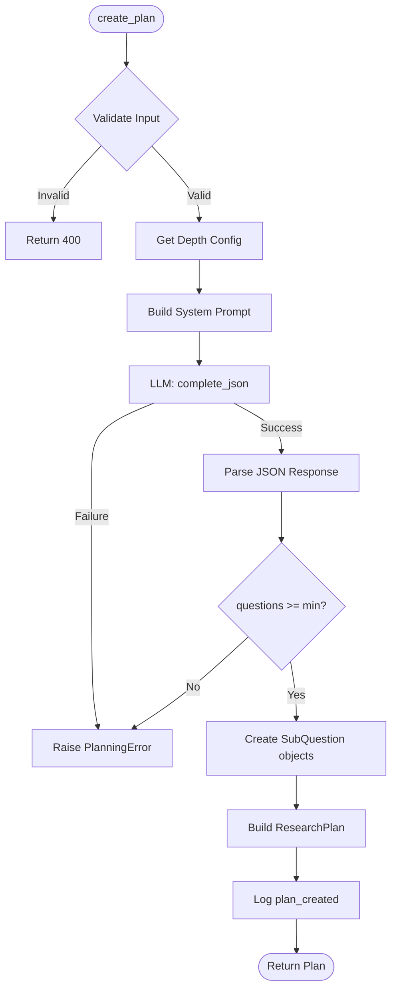
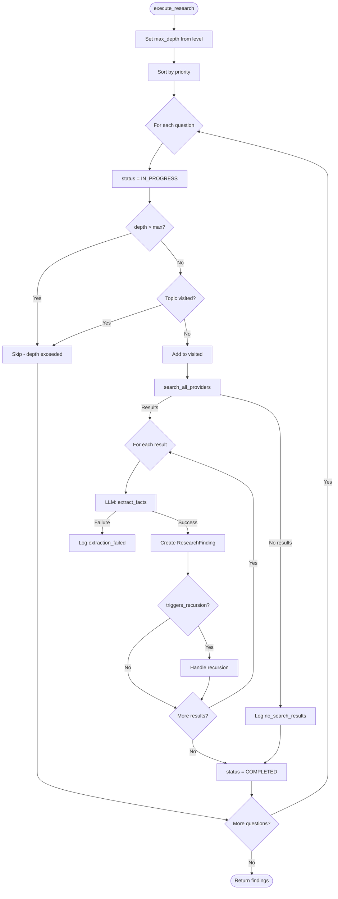
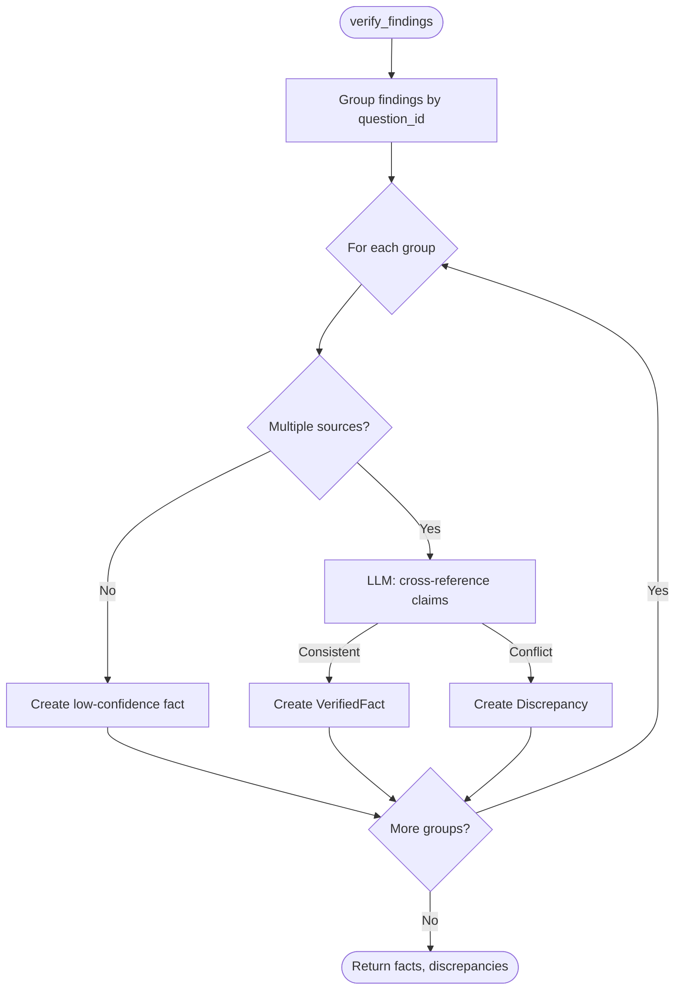
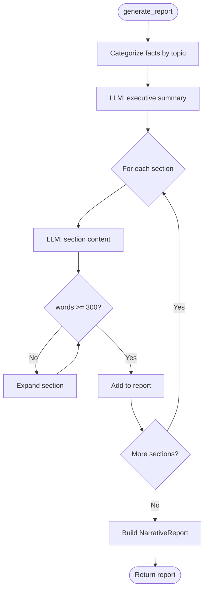
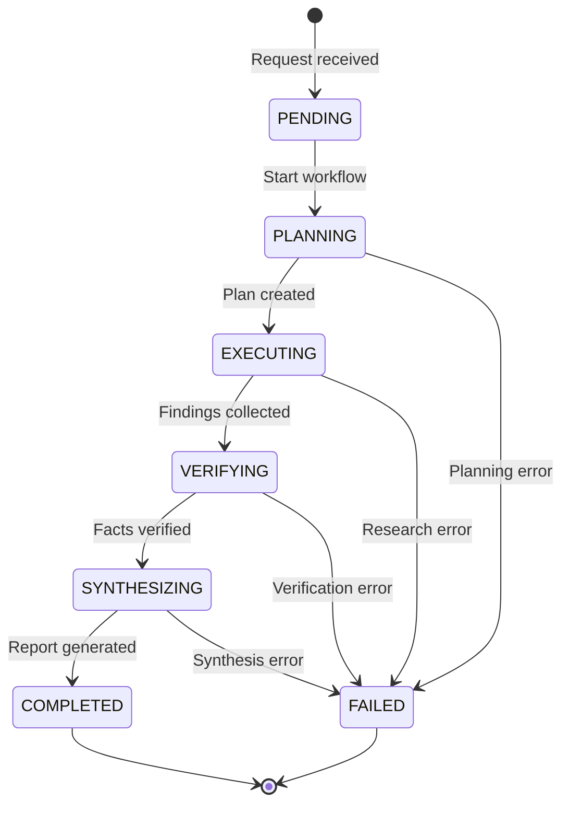
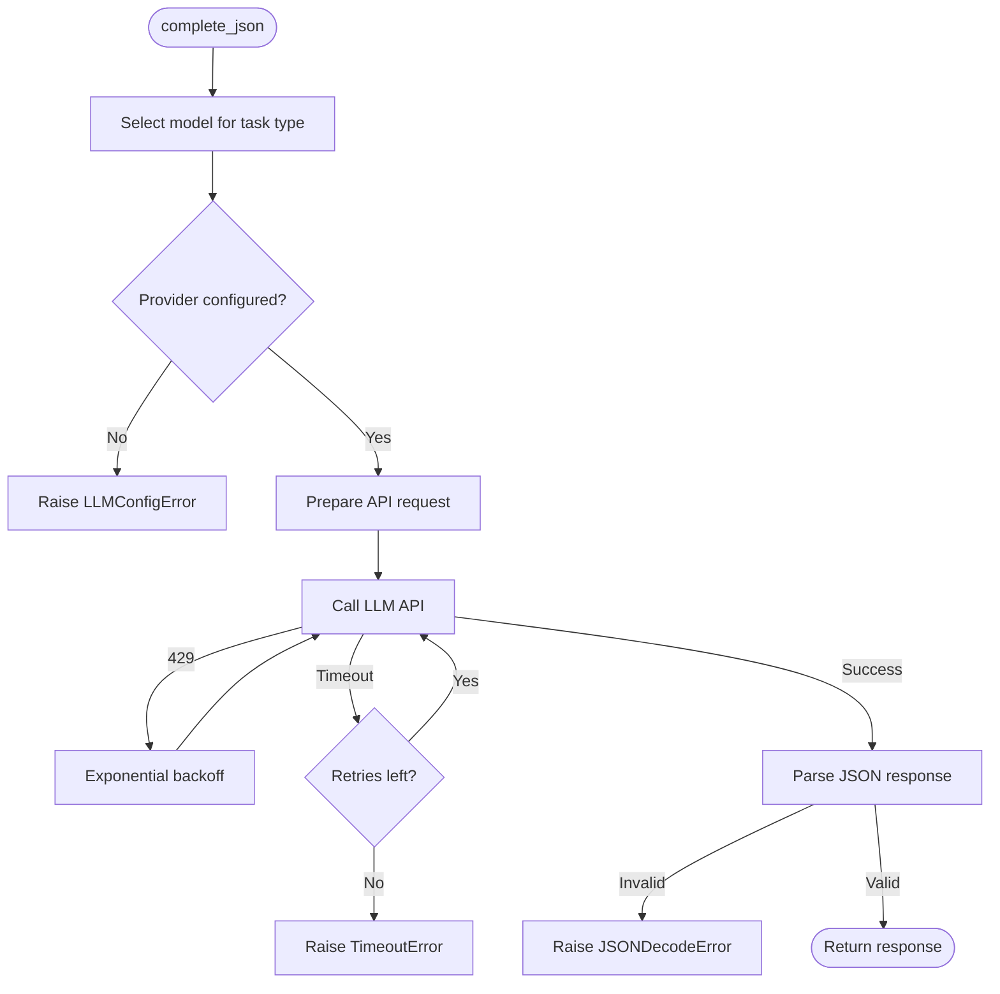
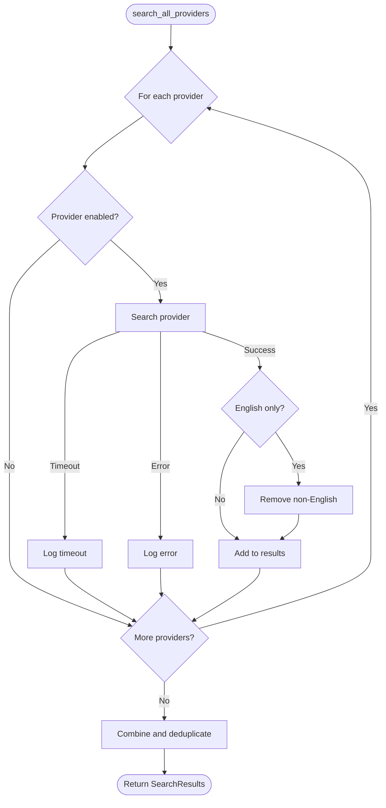

# Service Flow Diagrams

## Individual Service Flows

### Planner Service Flow

### DeepResearcher Service Flow

### Verifier Service Flow

### Synthesizer Service Flow

---

## Orchestrator Coordination

---

## LLM Client Flow

---

## Search Client Flow

