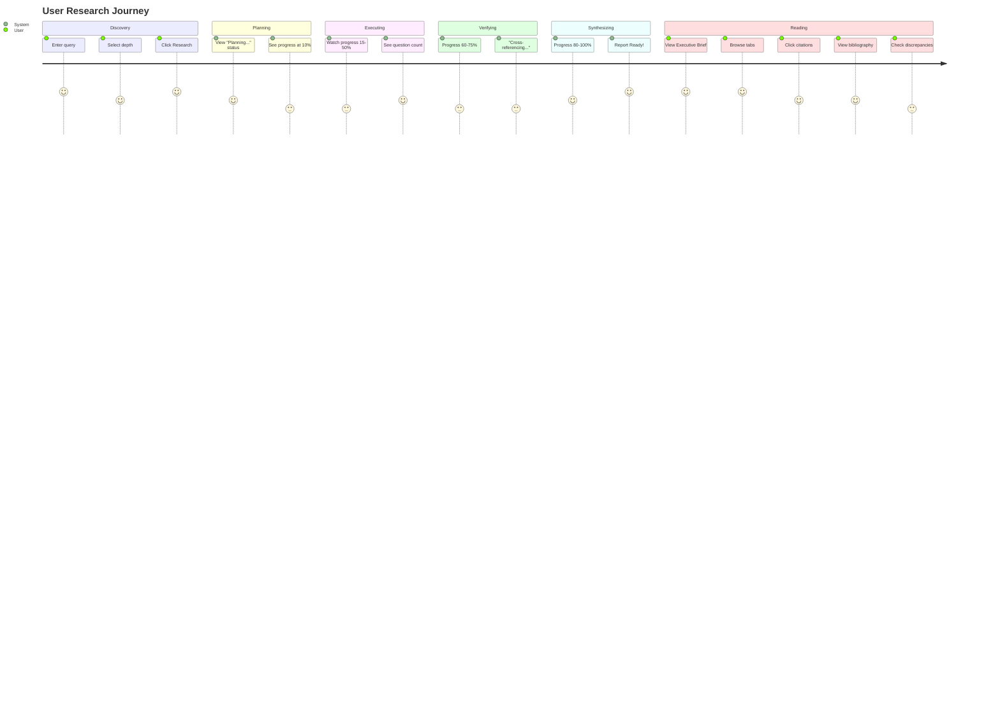

# User Journey Map

## Research Flow



---

## UI States

### 1. Initial State
```
┌─────────────────────────────────────────────┐
│  🔬 Intelligent Research Agent              │
│                                             │
│  ┌─────────────────────────────────────┐   │
│  │ 🔍 Enter your research query...     │   │
│  └─────────────────────────────────────┘   │
│                                             │
│  Research Depth:                            │
│  ┌─────┐  ┌─────────┐  ┌─────────────┐     │
│  │ ⚡   │  │ 📊      │  │ 🔬          │     │
│  │Quick │  │Standard │  │Comprehensive│     │
│  └─────┘  └─────────┘  └─────────────┘     │
└─────────────────────────────────────────────┘
```

### 2. Processing State
```
┌─────────────────────────────────────────────┐
│  ████████████░░░░░░░░░░░░  35%              │
│                                             │
│  ⏳ Researching...                          │
│  ┌─────┐  ┌─────┐  ┌─────┐  ┌─────┐        │
│  │ ✓   │  │ 🔄  │  │     │  │     │        │
│  │Plan │  │Exec │  │Verify│  │Synth│        │
│  └─────┘  └─────┘  └─────┘  └─────┘        │
│                                             │
│  2/5 questions completed                    │
└─────────────────────────────────────────────┘
```

### 3. Results State
```
┌─────────────────────────────────────────────┐
│  ← New Research                             │
├─────────────────────────────────────────────┤
│  Executive Brief                 ⏱ 1 min   │
│  ───────────────                            │
│  Tesla demonstrated strong Q4 performance   │
│  with revenue reaching $25B... [1]          │
├─────────────────────────────────────────────┤
│  [Overview] [Financials] [Market] [Outlook] │
├─────────────────────────────────────────────┤
│  Report generated from 12 verified sources  │
└─────────────────────────────────────────────┘
```

---

## Interaction Flows

### Citation Click
```
User clicks [1] → Tooltip appears with:
- Source title
- Extraction date
- Excerpt
- "View Original Source →" link
```

### Tab Navigation
```
User clicks tab → Smooth animation → New content loads
- Tab indicator slides
- Content fades in
- Word count badge updates
```

### Discrepancy Expansion
```
User clicks discrepancy → Accordion expands:
- Conflicting claims listed
- Sources for each claim
- Resolution notes
- Preferred interpretation
```

---

## Error States

| Scenario | UI Display |
|----------|------------|
| No API key | "Please configure API key" modal |
| LLM timeout | "Research taking longer than expected" + retry |
| No results | "No information found for this query" + suggestions |
| Rate limit | "Too many requests, please wait" countdown |
